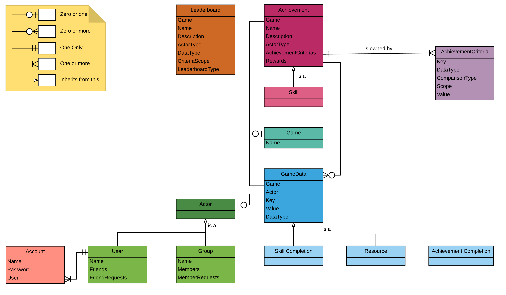

A User is the person playing the game. 

A Group is made up of a collection of Users.

Users and Groups both derive from the Actor type. 
This means that objects that reference an Actor can apply to either a User or a Group.

Actors can save GameData.

GameData could be:
A User's inventory
A User's high score
A Group's high score
etc
or any other kind of data that you need to persit between play sessions.
 
Resources are items that can be traded or consumed. 
n Actor may collect 20 gems and decide to give 10 of them to another actor at a later point resulting in both actors having 10 gems.
Remember that an Actor could be a User or a Group. 

As with GameData, Resources can be obtained and given by both Users and Groups.

Leaderboards are used to calculate an Actor's ranking against other actors of the same type.
One leaderboard may rank Groups by the amount of members they have, in a game where one goal is to make as big a group as possible.
Another leaderboard could be the typical high score, where Users are ranked by their score saved in the GameData.

Achievements look at the GameData of a specfic Actor to see whether they have met the completion criteria for the achievement.
An achievement that checks to see if the Actor's score is over 100. If so, the Actor has completed the Achievement.

Skills operate in the same way as Achievements but are conceptually different.
A Skill has the aim of teaching the player a "skill" in the process to completing it.
For example, a Skill may be to give 10 gems to 10 different people to complete the "sharing" Skill.

Achievements and Skills both have AchievementCriteria which is a set of conditions that need to be met in order for the Skill or Achievement to be concidered as completed.
AchievementCriteria can look for specific data in GameData.

Once any Skill or Acheivement has been completed by an Actor, the fact that it has been completed is saved in Skill Completion or Achievement Completion.

Once completed, an Achievement or Skill may offer rewards to the Actor. These rewards would be in the form of GameData. 
For example, an Actor may be credited with 20 points on completing an Achievement or Skill.
Those 20 points would be saved in that Actor's GameData.

Users can create, join and leave Groups.
Users can also befreiend other Users.

When a User requests another Users friendship, or to join a Group, the other User or Group has the ability to either approve or reject the request.

Because there may be multiple games, the Game is used to associate Achievements, Skills, Leaderboards, GameData, Resources, Skill Completion and Achievment Completion whithin a specific game.

Each user has an account.
The account is only used to faciliatate the user logging in.
After the user has logged in, the account is not used until the next time they log in.